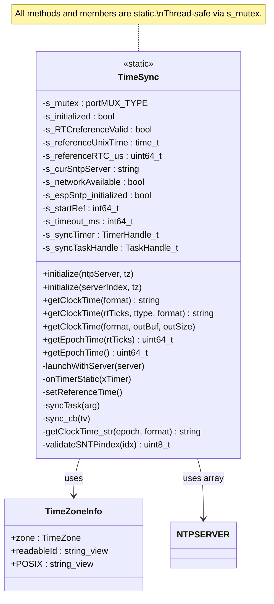
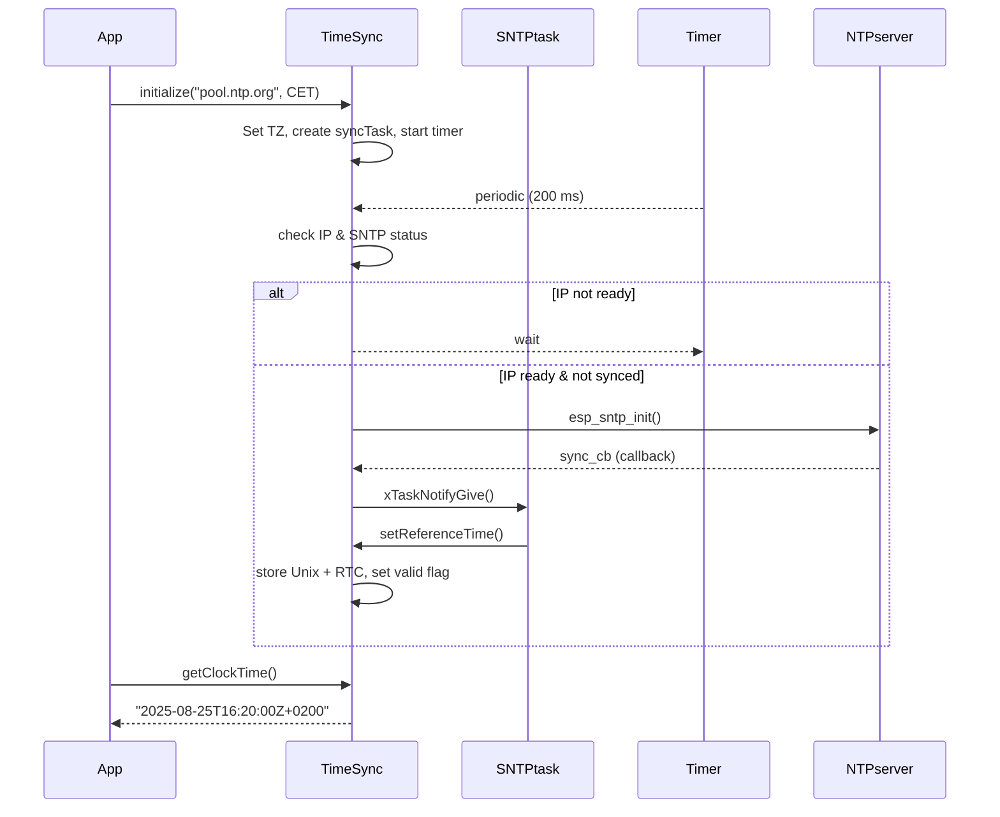

# ED_SNTP_time - Time Synchronization for ESP32

## Overview

`ED_SNTP_time` is a static‑only C++ class that synchronizes the ESP32 system clock using SNTP (Simple Network Time Protocol). It maintains a local reference (RTC timer) to provide **low‑latency, drift‑compensated time queries** even after the network synchronisation has completed. The class supports:

- Multiple fallback NTP servers (including a local intranet server like `raspi00`)
- Automatic server cycling on timeout
- Timezone and daylight saving configuration (POSIX TZ strings)
- ISO 8601 formatting (UTC/local, with/without offset)
- Thread‑safe access for FreeRTOS environments
- Zero‑allocation versions of `getClockTime()` for ISR or memory‑constrained contexts

The implementation uses the ESP‑IDF SNTP client and FreeRTOS timers/tasks to decouple network operations from application logic.

---

## Class Diagram (Mermaid)



---

## API Reference

### Initialisation

#### `void initialize(const char *ntpServer = NTPSERVER[0], TimeZone tz = TimeZone::CET)`

Starts the SNTP synchronisation process using a specific server hostname and sets the local timezone. Can be called only once; subsequent calls update the timezone only.

**Parameters**
- `ntpServer` – NTP server hostname or IP address.
- `tz` – Time zone (enum `TimeZone`). See table below.

#### `void initialize(uint8_t serverIndex, TimeZone tz = TimeZone::CET)`

Same as above but selects a server from the internal `NTPSERVER` array by index (0‑based). Out‑of‑range indexes wrap to 0.

**Available `TimeZone` values (POSIX strings)**

```cpp
CET          // CET-1CEST,M3.5.0/2,M10.5.0/3
WET          // WET0WEST,M3.5.0/1,M10.5.0/2
EET          // EET-2EEST,M3.5.0/3,M10.5.0/4
UK_GMT       // GMT0BST,M3.5.0/1,M10.5.0/2
// (others available if TZ_EXCLUDE_AMERICA is not defined)
```

### Time Queries

#### `std::string getClockTime(ISOFORMAT format = ISOFORMAT::DATETIME_UTC_OFFSET)`

Returns the current local/UTC time as a formatted string. If synchronisation has not yet completed, launches SNTP in the background and returns `"- no valid clock on ESP -"`.

#### `std::string getClockTime(uint64_t rtTicks, TICKTYPE ttype, ISOFORMAT format)`

Converts a given FreeRTOS tick count or ESP timer microsecond value into a formatted time string. Use this to timestamp events with sub‑second resolution **without** calling `time()` (which can be slow).

- `rtTicks` – the tick value (e.g. from `xTaskGetTickCount()` or `esp_timer_get_time()`).
- `ttype` – `TICKTYPE::TICK_MS` or `TICKTYPE::TICK_US`.
- `format` – same ISO formats as above.

#### `void getClockTime(ISOFORMAT format, char *outBuf, size_t outSize)`

Zero‑allocation version of `getClockTime()`. Writes the formatted time into `outBuf`. Useful inside ISRs or when dynamic memory is prohibited.

#### `uint64_t getEpochTime(uint64_t rtTicks)`
#### `uint64_t getEpochTime()`

Returns the Unix epoch (seconds since 1970‑01‑01 UTC) corresponding to the given tick or the current time. Returns `0` if the reference is not yet valid.

### ISO Format Enum

```cpp
enum class ISOFORMAT {
    DATE_ONLY,              // "2025-08-25"
    DATETIME_LOCAL,         // "2025-08-25T14:30:00"
    DATETIME_UTC,           // "2025-08-25T12:30:00Z"
    DATETIME_OFFSET,        // "2025-08-25T14:30:00+0200"
    DATETIME_UTC_OFFSET,    // "2025-08-25T12:30:00Z+0200"
    WEEK_DATE,              // "2025-W34-1"
    ORDINAL_DATE            // "2025-237"
};
```

---

## Synchronisation Flow (Mermaid Sequence Diagram)



---

## Example Usage

### Basic Initialisation and Periodic Logging

```cpp
#include "ED_SNTP_time.h"
#include "esp_log.h"
#include "freertos/FreeRTOS.h"
#include "freertos/task.h"

extern "C" void app_main() {
    // Start sync with Italian NTP server and CET timezone
    ED_SNTP::TimeSync::initialize("ntp.inrim.it", ED_SNTP::TimeZone::CET);

    // Wait a moment for first sync (optional)
    vTaskDelay(pdMS_TO_TICKS(5000));

    while (1) {
        std::string now = ED_SNTP::TimeSync::getClockTime();
        ESP_LOGI("MAIN", "Current time: %s", now.c_str());
        vTaskDelay(pdMS_TO_TICKS(10000));
    }
}
```

### Timestamping an Interrupt with Microsecond Precision

Suppose you capture a GPIO interrupt time using `esp_timer_get_time()`. You can convert that raw tick into a human‑readable string without calling `time()`.

```cpp
#include "ED_SNTP_time.h"

void IRAM_ATTR gpio_isr_handler(void* arg) {
    uint64_t tick_us = esp_timer_get_time();
    // Use the zero‑allocation version (ISR safe)
    char timebuf[32];
    ED_SNTP::TimeSync::getClockTime(ED_SNTP::ISOFORMAT::DATETIME_OFFSET,
                                    timebuf, sizeof(timebuf));
    // Now timebuf contains the timestamp of the interrupt
    // (Note: the formatting function is not ISR‑safe itself because it calls gmtime_r,
    // but it does not allocate. For real ISR usage you should set a flag and defer.)
}
```

### Querying Time from a Specific Tick (e.g. FreeRTOS tick count)

```cpp
uint32_t tick_ms = xTaskGetTickCount();
std::string timestamp = ED_SNTP::TimeSync::getClockTime(
    tick_ms,
    ED_SNTP::TICKTYPE::TICK_MS,
    ED_SNTP::ISOFORMAT::DATETIME_LOCAL
);
ESP_LOGI("EVENT", "Event at %s", timestamp.c_str());
```

### Getting Unix Epoch for a Sensor Reading

```cpp
uint64_t sensor_tick_us = esp_timer_get_time();
uint64_t epoch_sec = ED_SNTP::TimeSync::getEpochTime(sensor_tick_us);
if (epoch_sec != 0) {
    ESP_LOGI("SENSOR", "Sensor reading at Unix time %llu", epoch_sec);
}
```

---

## Error Handling & Notes

- If `initialize()` has never been called, the first call to any `getClockTime()` method will automatically launch synchronisation and return an invalid string (`"- no valid clock on ESP -"`). This auto‑launch happens only once; subsequent calls will keep returning the invalid string until sync completes.
- The class cycles through the list of servers (`NTPSERVER`) if a sync attempt times out (default 1000 ms, increments after each failure).
- After a successful sync, the SNTP client is stopped to free resources; time is then derived from the internal RTC reference.
- The zero‑allocation `getClockTime(format, outBuf, outSize)` does **not** allocate memory, but it does call `localtime_r()`/`gmtime_r()` and `strftime()`. Those are thread‑safe and not ISR‑safe in the strict sense (they may use lock‑free internal data). Use them from task context.
- The internal sync task runs at priority 5. Adjust if needed by modifying the `xTaskCreate` call.

---

## Thread Safety

All static data is protected by a `portMUX_TYPE` spinlock (`s_mutex`). FreeRTOS tasks and the timer callback use critical sections to read/write shared state. The SNTP callback (`sync_cb`) only notifies the task; it does not directly access shared variables.

---

## Dependencies

- ESP‑IDF v4.4 or later (tested with v5.x)
- Components: `esp_netif`, `esp_sntp`, `freertos`, `esp_timer`
- C++17 (for `std::string_view` in the timezone table)

---

## License & Author

Original author: Emanuele Dolis (edoliscom@gmail.com)
Version: 0.2 (improved concurrency and bug fixes)
Date: 2025‑08‑25 (revised 2026‑05‑07)
```