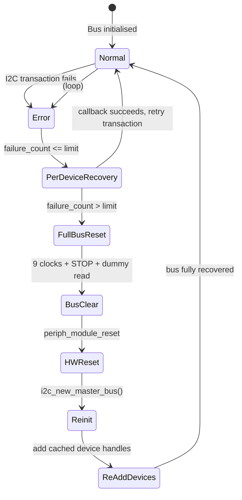

# I2CBus – Automatic Recovery I2C Master Library

## Overview

`I2CBus` is a C++ class for ESP‑IDF (ESP32‑C6 / S3 / C3) that wraps the I2C master driver with **automatic bus recovery**. It detects transient errors (NACK, timeout, invalid state) and executes a multi‑step hardware recovery sequence. The library is designed for **industrial‑grade robustness**: after a physical cable disconnection/reconnection, the I2C communication resumes without rebooting the ESP.

---

## Recovery Mechanism (Detailed)

The recovery is triggered whenever an I2C transaction returns an error (`ESP_ERR_TIMEOUT`, `ESP_ERR_INVALID_STATE`, `ESP_FAIL`, etc.). The algorithm follows the state machine below:



The recovery process is split into two levels:

### Level 1: Per‑Device Soft Recovery (optional)

When a transaction to a specific device address fails, the library:
1. **Increments a failure counter** for that address.
2. **If a recovery callback was registered for that address** and the failure count is ≤ `PER_DEVICE_RETRY_LIMIT` (default 3), it calls that callback.
3. The callback should **re‑apply the device’s configuration** (or send a software reset command).
4. If the callback returns `ESP_OK`, the failure counter is reset and the original transaction is retried immediately – **without touching the bus hardware**.
5. If the callback fails, the failure counter increases and the next attempt may escalate to a full bus reset.

**This level is optional.** You only need to register a recovery callback if your device **loses its configuration** during a bus fault (e.g., software‑only state, volatile registers, or if it gets power‑cycled). Devices that retain configuration (e.g., OPT3001, most EEPROMs, RTCs with backup battery) **do not need** a callback.

### Level 2: Full Hardware Bus Reset (always performed)

If per‑device recovery fails `PER_DEVICE_RETRY_LIMIT` times consecutively for a given address, or if no callback is registered (failure count simply exceeds limit), the library performs a **full hardware bus reset**:

1. **Bus Clear (9 clocks + STOP + dummy read)** – forces any stuck slave to release the bus.
2. **Peripheral Hardware Reset** – resets the ESP‑I2C controller via `periph_module_reset`.
3. **Delete and Re‑create Master Bus** – deletes the old bus handle and creates a new one.
4. **Re‑add Device Handles** – re‑adds all cached device handles.
5. **Execute Registered Recovery Callbacks** – if any callbacks are registered, they are called now.

After a successful full bus reset, the original transaction is retried. The whole process is transparent to the application: the I2C call (`write`, `read`, `write_then_read`) only returns `ESP_OK` when the operation finally succeeds.

---

## How a Device Driver Should Use I2CBus

A device driver must **not** store or use raw `i2c_master_dev_handle_t`. Instead, it should:

1. **Receive a reference to `I2CBus`** and its own I2C address.
2. **Use the bus’s public methods** `write()`, `read()`, `write_then_read()` for all transactions.
3. **Implement two separate methods** (if needed):
   - `init()` – Called once at startup to configure **all** device registers.
   - `recover()` – **Optional**. Only needed if the device loses configuration during a bus fault. This method should restore the **minimal volatile state** (mode, range, conversion time) and **not** overwrite persistent user settings (thresholds, fault counts, etc.).
4. **Register `recover()` only if required** using `register_recovery_callback()`. Otherwise, do not register any callback.

### When is a recovery callback required?

| Device type | Example | Needs callback? | Reason |
|-------------|---------|-----------------|--------|
| Configuration held in volatile registers | Sensors that lose mode/range after bus fault | **Yes** | Must re‑write settings after bus reset. |
| Configuration stored in non‑volatile memory | EEPROM, RTC with backup battery, OPT3001 | **No** | Registers survive bus fault. |
| Device that is power‑cycled during recovery | Controlled by external MOSFET | **Yes** | Must re‑apply full configuration after power‑on. |

For the **OPT3001**, the configuration registers are non‑volatile while the sensor remains powered. Therefore, **no recovery callback is needed**. The bus will recover automatically after a disconnection/reconnection.

### Example: OPT3001 (no callback needed)

```cpp
I2CBus i2c(I2C_NUM_0, GPIO_NUM_21, GPIO_NUM_22, 400000);
OPT3001 sensor(i2c, 0x44);

// Configure once
ED_OPT3001::OPT3001::ConfigReg cfg{};
cfg.mode_of_conversion = OPT3001::CONTINUOUS_B;
cfg.conversion_time    = OPT3001::TIME_100MS;
cfg.range_number_field = OPT3001::RN_AUTO;
sensor.configure(cfg);

// Do NOT register any recovery callback

// Read lux in a loop – bus will recover automatically
while (1) {
    float lux;
    if (sensor.readLux(lux) == ESP_OK) ESP_LOGI("main", "Lux = %.2f", lux);
    vTaskDelay(pdMS_TO_TICKS(500));
}
```

### Example: Device that needs a recovery callback

Suppose a device loses its mode setting after a bus stall. Its driver could look like:

```cpp
class MyDevice {
public:
    esp_err_t init() { /* full config */ }
    esp_err_t recover() {
        // Restore only volatile state
        return writeRegister(MODE_REG, CONTINUOUS_MODE);
    }
};

MyDevice dev;
i2c.register_recovery_callback(addr, [&dev]() { return dev.recover(); });
```

---

## API Reference

### `I2CBus` Class

| Method | Description |
|--------|-------------|
| `I2CBus(port, sda, scl, freq)` | Constructor. Initialises the I2C master bus. |
| `~I2CBus()` | Destructor. Cleans up bus and devices. |
| `esp_err_t write(uint8_t addr, const uint8_t* data, size_t len)` | Transmits data to a slave. Auto‑retry + recovery. |
| `esp_err_t read(uint8_t addr, uint8_t* data, size_t len)` | Receives data from a slave. Auto‑retry + recovery. |
| `esp_err_t write_then_read(uint8_t addr, const uint8_t* wdata, size_t wlen, uint8_t* rdata, size_t rlen)` | Combined transmit‑receive. Auto‑retry + recovery. |
| `esp_err_t register_recovery_callback(uint8_t addr, std::function<esp_err_t(void)> callback)` | **Optional.** Registers a per‑device recovery callback. Only needed if device loses configuration. |

### Recovery Callback (optional)

- **Signature**: `esp_err_t callback(void)`
- **When called**:
  - During **per‑device soft recovery** (if registered and failure count ≤ limit).
  - After a **full bus reset** (if registered).
- **What to do**: Restore only **volatile** device settings (mode, range, conversion time). Do **not** overwrite persistent user settings.
- **Important**: The callback must be **idempotent** and **fast**. It must not rely on any stale handles; use only the bus’s public methods.

---

## Tuning Parameters (in `ED_i2c.cpp`)

| Macro | Default | Description |
|-------|---------|-------------|
| `I2C_MAX_RETRY_ATTEMPTS` | `-1` (infinite) | Maximum number of retry loops before giving up. |
| `PER_DEVICE_RETRY_LIMIT` | `3` | Number of consecutive per‑device recovery attempts before full bus reset. |
| `I2C_BASE_RETRY_DELAY_MS` | `200` | Initial delay between recovery attempts (ms). |
| `I2C_MAX_RETRY_DELAY_MS` | `2000` | Maximum exponential backoff delay. |
| `POST_CLEAR_DELAY_MS` | `100` | Delay after peripheral reset before re‑initialising the bus. |

---

## Hardware Requirements

- **Pull‑up resistors**: Mandatory on both SDA and SCL lines. **2.2 kΩ – 4.7 kΩ**.
  Internal pull‑ups of ESP32‑C6 (~45 kΩ) are too weak for reliable recovery after a disconnection.
- **Power**: If a slave loses power during disconnection, you must add a power‑cycle mechanism (e.g., MOSFET). The bus recovery alone cannot reset a powered‑down slave.

---

## Troubleshooting

| Symptom | Likely Cause | Solution |
|---------|--------------|----------|
| Bus never recovers after disconnection | Missing external pull‑ups | Add 2.2kΩ – 4.7kΩ resistors on SDA/SCL |
| Stack overflow during recovery (crash) | Unnecessary recovery callback performing I2C writes | Remove callback if device retains config |
| Full bus reset loops indefinitely | Slave permanently stuck (holds SDA low) | Check hardware (pull‑ups, power, wiring) |
| Device still not responding after recovery | Device lost configuration but no callback registered | Register a lightweight recovery callback |

---

## Version History

- **v2.0** – Added per‑device soft recovery, failure counter, exponential backoff, full hardware bus reset. **Clarified that recovery callbacks are optional**.
- **v1.0** – Basic bus clear and device handle caching.

---

## License

MIT License. See repository for details.
```