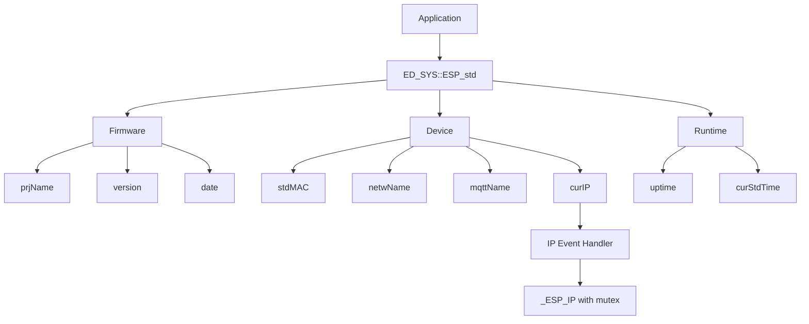

# ED_SYS Module Documentation

The `ED_SYS` namespace provides standardized access to firmware, device, network, and runtime information for ESP32-based projects. It is designed to be thread-safe, efficient, and easy to use in FreeRTOS environments.

## Architecture Overview



## Components

### 1. Firmware Info
Static methods returning build information from the ESP-IDF app descriptor.

| Method | Return Value |
|--------|---------------|
| `prjName()` | Project name as defined in CMakeLists.txt |
| `version()` | Firmware version string |
| `date()`    | Build date and time |

### 2. Device Identity
Provides consistent device identifiers across the system.

| Method | Description | Example |
|--------|-------------|---------|
| `stdMAC()` | Base MAC address as a string | `"AA:BB:CC:DD:EE:FF"` |
| `netwName()` | Network friendly name | `"ESP_AB_CD_EF"` |
| `mqttName()` | MQTT client ID | `"ESP_AB:CD:EF"` |
| `curIP()`   | Current IPv4 address (with event‑driven update) | `"192.168.1.100"` |

**Thread‑safety**: `curIP()` uses a `std::mutex` and registers the IP event handler exactly once via `std::call_once`.

### 3. Runtime Information

| Method | Description | Format |
|--------|-------------|--------|
| `uptime()` | Time since boot | `"5 d 03:14:15"` (days hours:minutes:seconds) |
| `curStdTime()` | Current UTC time with offset | ISO 8601 format, e.g. `"2025-08-29T14:30:00+00:00"` |

## Usage Examples

### Basic Initialization and Logging

```cpp
#include "ED_sys.h"
#include <esp_log.h>

extern "C" void app_main() {
    ESP_LOGI("MAIN", "Project: %s", ED_SYS::ESP_std::Firmware::prjName());
    ESP_LOGI("MAIN", "Version: %s", ED_SYS::ESP_std::Firmware::version());
    ESP_LOGI("MAIN", "Built: %s", ED_SYS::ESP_std::Firmware::date());
    ESP_LOGI("MAIN", "MAC: %s", ED_SYS::ESP_std::Device::stdMAC());
    ESP_LOGI("MAIN", "Network name: %s", ED_SYS::ESP_std::Device::netwName());
    ESP_LOGI("MAIN", "MQTT client ID: %s", ED_SYS::ESP_std::Device::mqttName());
}
```

### Monitoring IP Address and Uptime

```cpp
#include "ED_sys.h"
#include <esp_log.h>
#include <freertos/FreeRTOS.h>
#include <freertos/task.h>

extern "C" void app_main() {
    while (1) {
        const char* ip = ED_SYS::ESP_std::Device::curIP();
        if (ip[0] != '\0') {
            ESP_LOGI("MAIN", "Current IP: %s", ip);
            break;
        }
        ESP_LOGW("MAIN", "Waiting for IP...");
        vTaskDelay(pdMS_TO_TICKS(1000));
    }

    while (1) {
        ESP_LOGI("MAIN", "Uptime: %s", ED_SYS::ESP_std::Runtime::uptime());
        ESP_LOGI("MAIN", "Current time: %s", ED_SYS::ESP_std::Runtime::curStdTime());
        vTaskDelay(pdMS_TO_TICKS(60000)); // every minute
    }
}
```

### Using in a Class (C++)

```cpp
#include "ED_sys.h"
#include <string>

class MyDevice {
public:
    void printInfo() {
        std::string topic = "devices/";
        topic += ED_SYS::ESP_std::Device::mqttName();
        ESP_LOGI("DEVICE", "MQTT topic: %s", topic.c_str());
    }

    bool isOnline() {
        return ED_SYS::ESP_std::Device::curIP()[0] != '\0';
    }
};
```

## Thread Safety Notes

- `curIP()`: Fully thread‑safe. The static buffer `_ESP_IP` is protected by a `std::mutex`.
- The IP event handler is registered exactly once using `std::call_once`, even if multiple tasks call `curIP()` concurrently.
- Other methods (`stdMAC`, `netwName`, `mqttName`, `uptime`, `curStdTime`) are read‑only after first initialization and are safe to call from any task (no shared mutable state beyond initial lazy init, which is idempotent).

## Dependencies

- ESP-IDF components: `esp_event`, `esp_netif`, `esp_timer`, `esp_app_desc`
- Internal modules: `ED_SNTP_time`, `ED_sysInfo`
- C++ standard library: `<mutex>`, `<cstring>`

## Error Handling

- If `curStdTime()` fails to retrieve the time (e.g., SNTP not synced), it returns `"N/A"` and logs an error.
- `curIP()` returns an empty string until an IP is obtained via DHCP.
- All methods that use internal static buffers are safe with respect to buffer overflows (bounds checked using `sizeof`).

## Integration with CMake

Add to your `CMakeLists.txt`:

```cmake
# (Outside this block, normal backticks are fine, but inside we use ```)
```
Actually, in the documentation block itself, we must also replace any triple backticks. The line above contains ```cmake - that must become ```cmake. However, since this is a markdown example inside the documentation, I'll show it correctly.

Let me correct that part:

```cmake
idf_component_register(SRCS "ED_sys.cpp"
                       INCLUDE_DIRS "."
                       REQUIRES esp_event esp_netif esp_timer ED_SNTP_time ED_sysInfo)
```

## API Reference

All methods are `static` and belong to nested structs inside `ED_SYS::ESP_std`.

### Firmware

- `static const char* prjName()`
- `static const char* version()`
- `static const char* date()`

### Device

- `static const char* stdMAC()`
- `static const char* netwName()`
- `static const char* mqttName()`
- `static const char* curIP()`

### Runtime

- `static const char* uptime()`
- `static const char* curStdTime()`

## Changelog

- **v0.2** (after review): Added mutex protection for `_ESP_IP`, `std::call_once` for event registration, error handling in `curStdTime()`, performance improvements in MAC access, consistent logging, and uptime format fix.
- **v0.1**: Initial version.

```