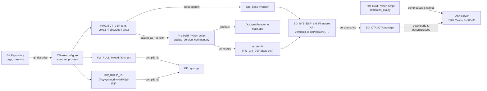

# Firmware Versioning & OTA Architecture

This document describes how the Git version is propagated and managed throughout the Pxxx project, from the Git repository to the running firmware and over‑the‑air updates.

---

## 1. Overview

The project uses a **single source of truth** for the version: the Git tag and commit history.
All version information (tag, commit hash, build number, dirty state) flows through:

1. **CMake** configuration → sets `PROJECT_VER` and compile definitions.
2. **ESP‑IDF build system** → embeds the version in `app_desc`.
3. **A Python pre‑build script** (`update_version_comment.py`) → updates the Doxygen header in `main.cpp` and generates `version.h`.
4. **A Python post‑build script** (`compress_ota.py`) → compresses the firmware and copies it to an OTA server.
5. **The `ED_SYS::ESP_std::Firmware` C++ API** → provides a unified interface to all version components.
6. **The `ED_OTA::OTAmanager`** → selects the correct firmware file from the server.

The following chart shows the overall flow from Git to the deployed firmware.



---

## 2. Version Sources and Their Roles

### 2.1 `PROJECT_VER` (CMake variable)

- **Creation**: In the root `CMakeLists.txt`, `execute_process` runs `git describe --tags --dirty --always` once at configure time. The result (e.g. `v0.0.1-4-gbb20eb4-dirty`) is stored in `PROJECT_VER`.
- **Embedded in firmware**: `PROJECT_VER` is given to `project(...)` and ends up in the `app_desc` structure (`app_desc->version`).
- **Usage**: All runtime version queries (boot log, `ED_SYS::Firmware::version()`, LED colour logic) read this string.

### 2.2 Python Pre‑build Script (`update_version_comment.py`)

- **Triggered**: Before the main firmware link (`add_dependencies(${CMAKE_PROJECT_NAME}.elf update_version_info)`).
- **Receives** the canonical version via `--version "${PROJECT_VER}"` from CMake.
- **Updates**:
  - The Doxygen comment block at the top of `main.cpp` (line `@version GIT_VERSION: ...`).
  - `version.h` containing `FW_GIT_VERSION`, `FW_GIT_TAG`, `FW_GIT_HASH`, `FW_FULL_HASH`, `FW_BUILD_ID`.
- **Goal**: Ensure the header comment and `version.h` always match the actual firmware version.

### 2.3 Compile‑time Definitions (FW_FULL_HASH, FW_BUILD_ID)

- **Provided by CMake** as target compile definitions (`PRIVATE`).
- Used by `ED_sys.cpp` to expose the full commit hash and a human‑readable build ID (`PYYYYMMDD-HHMMSS-ffffff`).
- These values are passed directly to the compiler and are **not** derived from the version string.

---

## 3. The Unified C++ API

All version components are accessible through `ED_SYS::ESP_std::Firmware`:

| Method            | Returns               | Example                      |
|-------------------|-----------------------|------------------------------|
| `version()`       | Full Git description  | `"v0.0.1-4-gbb20eb4-dirty"` |
| `majorVersion()`  | int                   | `0`                          |
| `minorVersion()`  | int                   | `0`                          |
| `patchVersion()`  | int                   | `1`                          |
| `buildNumber()`   | int (commits since tag)| `4`                          |
| `tag()`           | Tag string            | `"v0.0.1"`                   |
| `shortHash()`     | Short commit hash     | `"gbb20eb4"`                 |
| `isDirty()`       | bool                  | `true` if working tree dirty |
| `fullHash()`      | Full 40‑char hash     | `"bb20eb47fd48..."`          |
| `buildId()`       | Build timestamp       | `"P20260509-140435-179518"` |

The version string is parsed **once** on first access and results are cached. The `fullHash()` and `buildId()` come from compile‑time definitions (not parsed from the version string) because they are not part of `git describe`.

### Usage example

```cpp
#include "ED_sys.h"

// ...
int patch = ED_SYS::ESP_std::Firmware::patchVersion();
if (patch == 1) {
    // set red LED
} else if (patch == 2) {
    // set blue LED
}
```

---

## 4. Example: Version Lifecycle

Suppose the Git repository is at commit `bb20eb4`, tagged `v0.0.1`, with 4 commits since the tag, and the working tree is dirty.

1. **CMake configure** runs:
   - `PROJECT_VER = v0.0.1-4-gbb20eb4-dirty`
   - `FW_FULL_HASH = bb20eb47fd48a219a1813fe82271ef3495210304`
   - `FW_BUILD_ID = P20260509-140435-179518`

2. **Pre‑build script**:
   - Updates `main.cpp`’s Doxygen header with `@version GIT_VERSION: v0.0.1-4-gbb20eb4-dirty`
   - Generates `version.h` containing:
     ```cpp
     #define FW_GIT_VERSION "v0.0.1-4-gbb20eb4-dirty"
     #define FW_GIT_TAG     "v0.0.1"
     #define FW_GIT_HASH    "gbb20eb4"
     #define FW_FULL_HASH   "bb20eb47fd48a219a1813fe82271ef3495210304"
     #define FW_BUILD_ID    "P20260509-140435-179518"
     ```

3. **Build**:
   - The firmware is compiled with `-DFW_FULL_HASH=... -DFW_BUILD_ID=...`.
   - `app_desc->version` is set to `"v0.0.1-4-gbb20eb4-dirty"`.

4. **Post‑build** (`compress_ota.py`):
   - Reads the version from `version.h` (`v0.0.1-4-gbb20eb4-dirty`) to name the file `Pxxx_v0.0.1-4-gbb20eb4-dirty.bin.lz4`.
   - Compresses the binary and copies it to `//raspi00/fware/`.

5. **OTA update**:
   - `ED_OTA::OTAmanager` scans the server directory for files matching the project name and version pattern.
   - It selects the file with the highest compatible version (based on locked version components).
   - Downloads, decompresses, and flashes the new firmware partition.

6. **After reboot**:
   - Boot log shows `App version: v0.0.1-4-gbb20eb4-dirty`.
   - `ED_SYS::Firmware::patchVersion()` returns `1`.
   - The LED blinks red (patch = 1).

---

## 5. Incremental Builds and Version Changes

The architecture guarantees that **any change to Git tags, commits, or dirty state automatically triggers the appropriate rebuild steps**, making incremental builds completely safe.

### 5.1 How dependency tracking works

| Change                     | Effect                                                        |
|----------------------------|---------------------------------------------------------------|
| Different `PROJECT_VER`    | The linker input (`app_desc` component) is regenerated, so the final binary always gets the new string. |
| Different `FW_FULL_HASH` or `FW_BUILD_ID` | The compile definition changes → `ED_sys.cpp` is recompiled. |
| Pre‑build script updates `main.cpp` | The script modifies the file → the build system sees the changed source and recompiles it. |

No manual `fullclean` is required. Simply run `idf.py build` after any Git operation (e.g., creating/deleting a tag, committing, or changing files) and the firmware will correctly incorporate the new version.

### 5.2 Historical note

In earlier versions of this system, `version.h` was included by `ED_sys.cpp`, but the generated header was not properly tracked as a dependency. This could lead to stale version strings when only the header changed. That approach has been replaced by compile‑time definitions, removing the need for manual clean rebuilds.

---

## 6. Files Involved in Version Tracking

All the files that participate in capturing, storing, or using the firmware version are listed below.

| File / Resource | Role |
|-----------------|------|
| **Git repository** (tags, commits) | Ultimate source of the version string. |
| `CMakeLists.txt` (root) | Runs `git describe` to obtain the version, sets `PROJECT_VER`, `FW_FULL_HASH`, `FW_BUILD_ID`, passes them to the build and to the pre‑build script. |
| `tools/update_version_comment.py` | Pre‑build script that receives the exact version from CMake and updates `main.cpp`’s Doxygen header and writes `version.h`. |
| `main.cpp` | Contains the Doxygen header block (including `@version GIT_VERSION: ...`) that is updated by the pre‑build script. |
| `build/main/version.h` | Generated header with macros `FW_GIT_VERSION`, `FW_GIT_TAG`, `FW_GIT_HASH`, `FW_FULL_HASH`, `FW_BUILD_ID`. Used by `compress_ota.py` for naming the OTA file. |
| `components/ED_sys/ED_sys.h` | Declares the `ED_SYS::ESP_std::Firmware` interface, including methods like `version()`, `patchVersion()`, `fullHash()`, `buildId()`. |
| `components/ED_sys/ED_sys.cpp` | Implements version parsing and exposes the compile‑time definitions `FW_FULL_HASH` and `FW_BUILD_ID`. |
| `tools/compress_ota.py` | Post‑build script that reads the version from `version.h`, compresses the firmware binary, and copies it to the OTA server with a filename based on that version. |
| OTA server directory (`//raspi00/fware/`) | Stores compressed firmware files named with the version (e.g., `Pxxx_v0.0.1-4-gbb20eb4-dirty.bin.lz4`). |
| `components/ED_OTA/ED_OTA.h` / `ED_OTA.cpp` | OTA manager that scans the server, parses filenames to extract versions, and selects the correct update candidate. |
| `components/ED_sys/ED_sysInfo.h` | Provides `ESP_MACstorage` and other system info – not directly version‑related but required by `ED_sys`. |

All these files work together so that every part of the system (the running firmware, the Doxygen header, the OTA filename, and the OTA scanner) uses the same version string derived from Git.

---

## 7. Summary

The versioning architecture ensures that every part of the system – the boot log, the `ED_SYS` API, the OTA filename, and the Doxygen header – reflects the exact Git state at build time. The key is the **single source of truth** in `PROJECT_VER`, propagated both into the binary and into the file system via the pre‑build script. The `ED_SYS::Firmware` class provides a clean, efficient way to access all version components at runtime.

Incremental builds are fully supported, so you can confidently rebuild after any Git change without needing a `fullclean`.